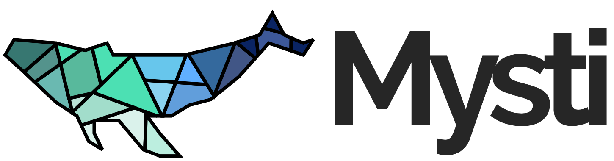

A file organizer for MacOS, created by Bach Nguyen for CS50 Final Project.

<i>Go [here](https://youtu.be/ynyTa0NRofQ) to see my final project video!</i>

### Installation

Visit the project page [here](https://bachtothefuture.github.io/Mysti/) to download the compiled application, and place it in your Applications folder. Mysti is ready to be used, and there's no need to compile anything!

### Usage

Check this manual page for more information on how to use the app!

### Running and Building Locally

#### 1. Installing dependencies

You would need `node` and `npm`, so if you have not done so yet, navigate to the [Node's downloads page](https://nodejs.org/en/download/) and install them using their installers.

Once installed, we would need to install all of the dependencies, so do so by typing `npm install`. Upon completion open up a new Terminal window and navigate to the directory that includes this `README` file. This will get you ready for the following steps.

#### 2. Running

If you want to make changes to the source code and test the changes, or if you want to debug, you would want to try to run this app locally first for testing.

The project has a client side and a server side. The client side displays the graphical interface shown in the app window, and the server side keeps the actual app and the window that contains the graphical interface running. You would need to run client side first, so do so by typing `npm run client`. This will open up a blank page on a web browser, but this is not the actual app, so go ahead and close it.

Then, open a new Terminal window, navigate to the same directory (the one with this `README`) and go ahead and run `npm run server`. This will open up the developer tools in a new window, as well as a new tray icon at the top right corner of the screen. Click on this tray icon to open the Mysti window!

#### 3. Building

If you want to compile the code to a native MacOS app and combine the client and the server parts together, run `npm run build`, then `npm run dist`. This will take a while so go get yourself some snacks or nice drinks!

Once the command is done, you'll see a new folder called `dist`. Navigate into this folder and and into a subfolder called `mac` and you'll an application file called "Mysti". This is the standalone application! Double click it to run Mysti.

### Special Thanks

Thank you so much to @dbilgili for his [Electron-React boilerplate](https://github.com/dbilgili/minimal-electron-react-boilerplate), which I used as a starting point for my project!

Also a special thanks to [Doğacan Bilgili](https://blog.logrocket.com/building-a-menu-bar-application-with-electron-and-react/) for his splendid tutorial on creating an Electron taskbar applicaiton.

